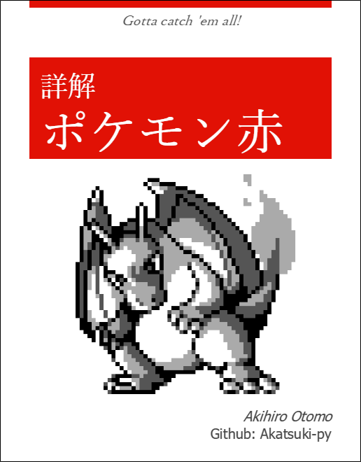

 →  [Click here to view this README in English…](https://www.github.com/Stack-in-a-box/understanding-pokemon-red-english-translation)

# 詳解ポケモン赤

**このレポジトリは未完成です！**

これは[ポケモン赤を逆アセンブルしたレポジトリ](https://github.com/pret/pokered)に対して、日本語で詳細な解説を加えたレポジトリです。

日本語で解説を加えてはいますが、対象のROMは英語版のポケモン赤であることに注意してください。

## 概要

上でも述べたように、このレポジトリは[ポケモン赤を逆アセンブルしたレポジトリ](https://github.com/pret/pokered)に対して、日本語で詳細な解説を加えたレポジトリです。

- ソースコードに対して日本語でコメントを追加
- [VSCodeの拡張機能](https://marketplace.visualstudio.com/items?itemName=donaldhays.rgbds-z80)を使っているときにコードリーディングが最大限やりやすいようにコメントフォーマットの修正
- データフォーマットやポケモン赤独自の概念に対する解説ドキュメント

これらを[元のレポジトリ](https://github.com/pret/pokered)に詳細に書き加えたものです。

## 前提知識

- アセンブリやリンカなどの一般的な低レイヤの知識
- gbz80のISAや割り込みやMBC、バンクなどのGameBoyのハードウェア仕様
- [rgbds(Rednex Game Boy Development System)](https://github.com/rednex/rgbds)に関する多少の理解

またエディタを使ってコードを読む場合はVSCodeと[rgbds用の拡張機能](https://marketplace.visualstudio.com/items?itemName=donaldhays.rgbds-z80)の使用を推奨します。

## ドキュメント一覧

- [2bpp](./docs/2bpp.md)
- [バッジ](./docs/badge.md)
- [バンク](./docs/bank.md)
- [BCD](./docs/bcd.md)
- [Boulder](./docs/boulder.md)
- [カートリッジ](./docs/cartridge.md)
- [Diploma](./docs/diploma.md)
- [イベント](./docs/event.md)
- [連行イベント](./docs/follow.md)
- [hidden object](./docs/hidden_object/README.md)
- [intro](./docs/intro.md)
- [キー入力](./docs/joypad.md)
- [list](./docs/list.md)
- [list menu](./docs/list_menu.md)
- [マクロ](./docs/macro.md)
- [Map](./docs/map/README.md)
- [メニュー](./docs/menu.md)
- [missable object](./docs/missable_object.md)
- [PC](./docs/pc/README.md)
- [pic](./docs/pic/README.md)
- [ポケモン図鑑](./docs/pokedex.md)
- [Pokemon](./docs/pokemon/README.md)
- [predef](./docs/predef.md)
- [rgbgfx](./docs/rgbgfx.md)
- [セーブ](./docs/save.md)
- [simulated joypad](./docs/simulated_joypad.md)
- [スプライト](./docs/sprite/README.md)
- [用語](./docs/term.md)
- [テキスト](./docs/text/README.md)
- [タイトル画面](./docs/titlescreen.md)
- [タイル](./docs/map/tile.md)
- [トレーナー](./docs/trainer/README.md)
- [ワープ](./docs/warp/README.md)
- [野生のポケモン](./docs/wild_pokemon.md)

## ファイル一覧

 ファイル名  |  内容
---- | ----
 audio/  |  TODO
 constants/  |  [constants](./constants/README.md)参照
 data/  |  [data](./data/README.md)参照
 engine/  |  [engine](./engine/README.md)参照
 gfx/  |  [gfx](./gfx/README.md)参照
 home/  |  [home](./home/README.md)参照
 macros/  |  [macros](./macros/README.md)参照
 maps/  |  [maps](./maps/README.md)参照
 pic/  |  [pic](./pic/README.md)参照
 scripts/  |  TODO
 text/  |  [text](./text/README.md)参照
 tools/  |  [tools](./tools/README.md)参照
 audio.asm  |  TODO
 charmap.asm  |  文字コードのマクロ定義
 constants.asm  |  定数シンボルのマクロ定義
 home.asm  |  TODO
 hram.asm  |  HRAM領域にどのようなデータが配置されるかの定義を行っている
 macros.asm  |  macros/以下の各マクロファイルをまとめている
 main.asm  |  TODO
 pokered.link  |  リンカスクリプト  各セクションがどのバンクのどのアドレスに配置されるかを指示している
 sram.asm  |  TODO
 text.asm  |  各テキストデータファイルをまとめている  pokered.linkでROMバンク$20以降に配置されている 
 vram.asm  |  TODO
 wram.asm  |  WRAM領域にどのようなデータが配置されるかの定義を行っている
