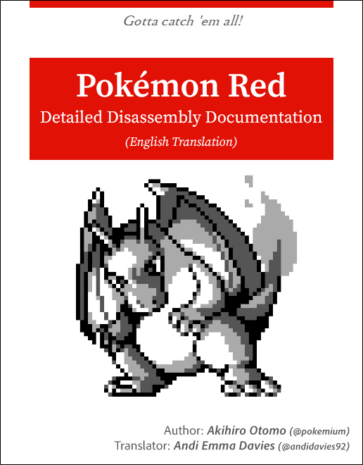

 →  [このドキュメントを日本語で表示するには、ここをクリックしてください…](README.jp.md)

# Pokémon Red – Detailed Disassembly Documentation

**Note:** _This repository is incomplete (as is this translation effort)!_

This repository is a comment-annotated fork of the [Pret collective](https://www.github.com/pret)’s [split disassembly of Pokémon Red](https://www.github.com/pret/pokered), with accompanying detailed documentation explaining some of the codebase’s core functions. The research present here was authored by [@pokemium](https://www.github.com/pokemium) and is in the process of being translated by [@andidavies92](https://www.github.com/andidavies92).

Please note that the target ROM is the _English-language_ version of Pokémon Red.

## Overview

As mentioned above, this repository contains the Pokémon Red disassembly and adds detailed explanations in Japanese, which will gradually be translated into English, as in this README. The original research effort provides the following:

* Comments added to the source code in Japanese.
* The comments are in a standardised format in order to maximise readability when used in conjunction with relevant [VS Code extensions](https://marketplace.visualstudio.com/items?itemName=donaldhays.rgbds-z80).
* Formal documentation for data formats and concepts unique to Pokémon Red.

These additions provide much-needed extra detailed information to the [original repository](https://www.github.com/pret/pokered).

## Prerequisites

This documentation assumes you already have some knowledge of:

* Low-level compilation steps, i.e. assemblers, linkers, etc.
* Game Boy hardware specifications, such as its Z80-like ISA (instruction set architecture), interrupts, MBCs (memory bank controllers), banking, and so on.
* [RGBDS (Rednex Game Boy Development System)](https://www.github.com/rednex/rgbds).

It’s also recommended to use Visual Studio Code along with this [RGBDS-tailored extension](https://marketplace.visualstudio.com/items?itemName=donaldhays.rgbds-z80) when wanting to read the code in an editor.

## Sections

Click on any of these topics to read more about them:

* [2bpp graphics format](docs/2bpp.md)
* [Binary-coded decimal](docs/bcd.md)
* [Boulders](docs/boulder.md)
* [Button input](docs/joypad.md)
* [Cartridge](docs/cartridge.md)
* [Conditional-visibility object](docs/missable_object.md)
* [Diploma](docs/diploma.md)
* [Events](docs/event.md)
* [Following NPCs](docs/follow.md)
* [Glossary](docs/term.md)
* [Gym badges](docs/badge.md)
* [Hidden objects](docs/hidden_object/README.md)
* [Intro sequence](docs/intro.md)
* [List data structure](docs/list.md)
* [List menus](docs/list_menu.md)
* [Macros](docs/macro.md)
* [Map](docs/map/README.md)
* [Menus](docs/menu.md)
* [PC](docs/pc/README.md)
* [“pic” data format](docs/pic/README.md)
* [Pokédex](docs/pokedex.md)
* [Pokémon data structure](docs/pokemon/README.md)
* [Pre-registering functions (“predef”)](docs/predef.md)
* [“rgbgfx” graphics converter](docs/rgbgfx.md)
* [ROM banks](docs/bank.md)
* [Saving](docs/save.md)
* [Simulated button presses](docs/simulated_joypad.md)
* [Sprites](docs/sprite/README.md)
* [Text](docs/text/README.md)
* [Tiles](docs/map/tile.md)
* [Title screen](docs/titlescreen.md)
* [Trainer data structure](docs/trainer/README.md)
* [Warps](docs/warp/README.md)
* [Wild Pokémon](docs/wild_pokemon.md)
