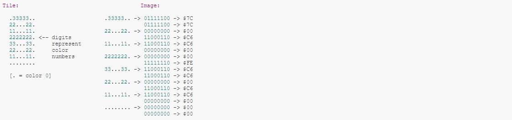

**Note:** _This section hasn’t been translated into English yet. The original Japanese version is below…_

# 2bppフォーマット

GameBoyのグラフィックフォーマット

2bitで1pxを表すことから2bpp(2 Bits Per Pixel)と呼ぶ。

2bitなので2*2=4パターンの色が最大で使用可能



2bppでは1タイルが16byteで表される。  
(1タイル = 8*8px = 64px なので 64\*2 = 128bit = 16\*8bit = 16byte)  

タイルの各行は2byteずつで表され、

```
0Byte -> 色の下位ビット(nbit目 -> 左からn pxの色)
1Byte -> 色の上位ビット(nbit目 -> 左からn pxの色)
```

を表す。

## 1bppフォーマット

2bppをさらに単純にした1bppフォーマットもある

1bitで1pxを表すことから1bpp(1 Bits Per Pixel)と呼ぶ。

1bitなので1*2=2パターンの色が最大で使用可能

1bppでは1タイルが8byteで表される。  
(1タイル = 8*8px = 64px なので 64\*1 = 64bit = 8\*8bit = 8byte)  

タイルの各行は1byteずつで表され、

```
Byte -> 色のビット情報(nbit目 -> 左からn pxの色)
```

を表す。

## 参考

[Learning the GFX Format - 2BPP Gameboy and SNES](https://wiki.superfamicom.org/learning-the-gfx-format-2bpp-gameboy-and-snes)