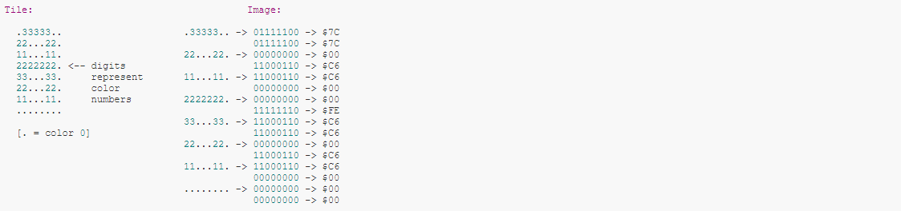

# 2bppフォーマット

GameBoyのグラフィックフォーマット

2bitで1pxを表すことから2bpp(2 Bits Per Pixel)と呼ぶ。

2bitなので2*2=4パターンの色が最大で使用可能



2bppでは1タイルが16byteで表される。  
(1タイル = 8*8px = 64px なので 64\*2 = 128bit = 16\*8bit = 16byte)  

タイルの各行は2byteずつで表され、

```
0Byte -> 色の下位ビット(nbit目 -> 左から(7-n)pxの色)
1Byte -> 色の上位ビット(nbit目 -> 左から(7-n)pxの色)
```

を表す。

## 関連

[1bpp](./1bpp.md)

## 参考

[Learning the GFX Format - 2BPP Gameboy and SNES](https://wiki.superfamicom.org/learning-the-gfx-format-2bpp-gameboy-and-snes)