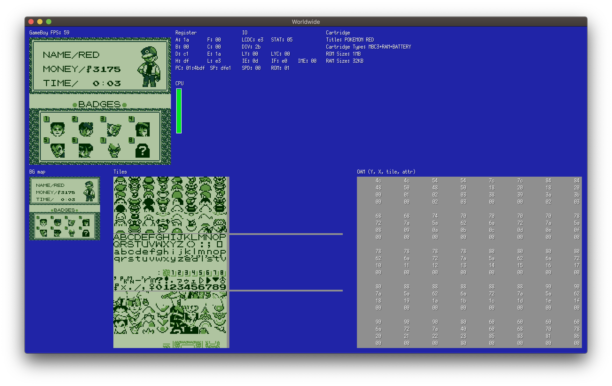

**Note:** _This section hasn’t been translated into English yet. The original Japanese version is below…_

# Badge

ジムバッジのこと

## wObtainedBadges

バッジを取得したかのフラグは `wObtainedBadges` で管理されている

`wObtainedBadges` は 1byteの領域で各bitがバッジの取得フラグとなっている  

## トレーナーカード

 &nbsp; 

日本語ROMではバッジ未取得の場合は、顔アイコンの上にトレーナーの名前が出る

英語版では、顔アイコンの上にトレーナーの名前が出ず、VRAMも空白

