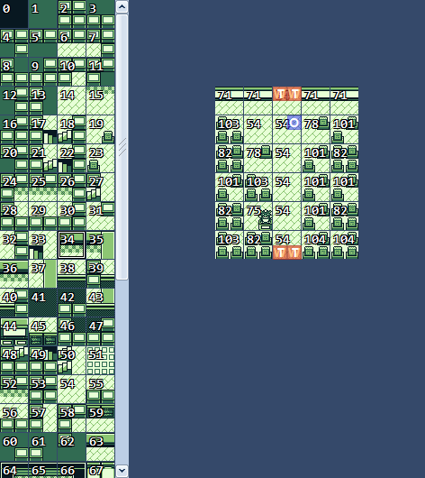
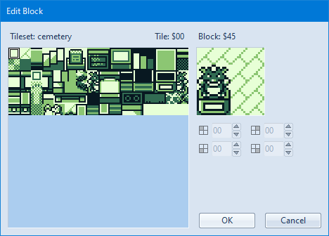

# blk

## blkファイルについて

blkファイルはブロックIDからなるデータリストで、パレットなどの色データは含まれていない

ポケモン赤では、マップはタイル単位ではなく4*4のタイルの塊であるブロック単位で構成されている  
ブロックIDはブロックデータの塊であるブロックセットから特定のブロックを指定するためのID  

## block(ブロック), tile block(タイルブロック)について

各ブロックは縦2枚、横2枚のタイルブロックからなる、32*32pxの塊

ブロックセット(ブロックデータの塊)のデータはmap/ではなくgfx/blocksetsに含まれている

なお、16*16pxの塊を表すのにも使われることがある？

## tile(タイル)について

[タイル](./tile.md)を参照

## マップデータの編集

マップデータの編集は[Polished Map](https://hax.iimarckus.org/topic/7222/)というソフトウェアを使うと楽に行える

## 参考

[.blk Readability](https://github.com/pret/pokered/issues/158)  
[discord](https://discordapp.com/channels/442462691542695948/442462691542695957/626440045863370795)  
[Polished Map 4.5.0 and 2.5.0++: a pokecrystal and pokered map editor](https://hax.iimarckus.org/topic/7222/)  