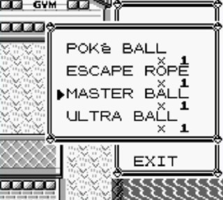
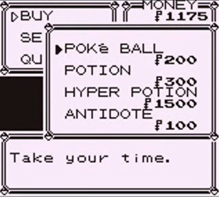
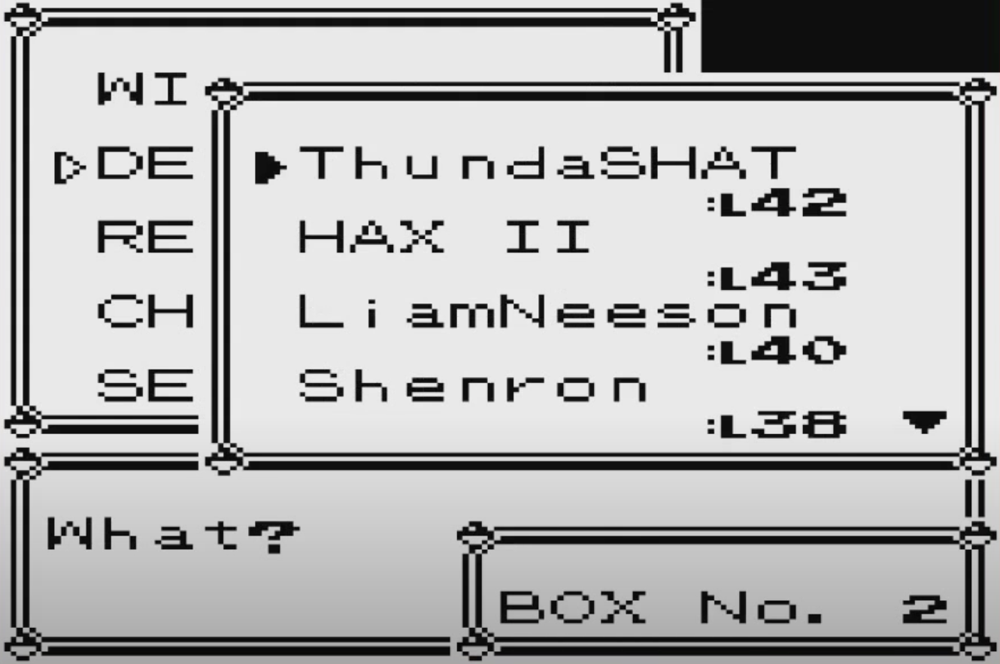
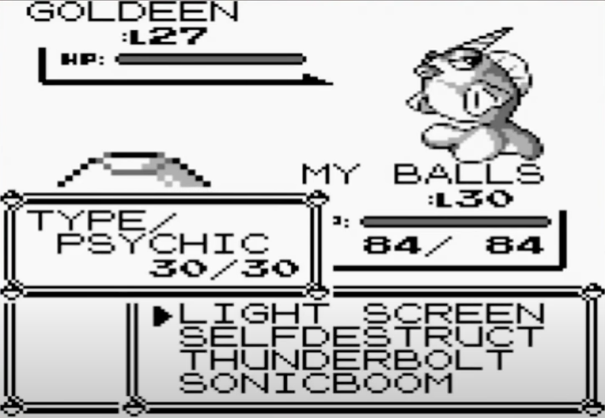
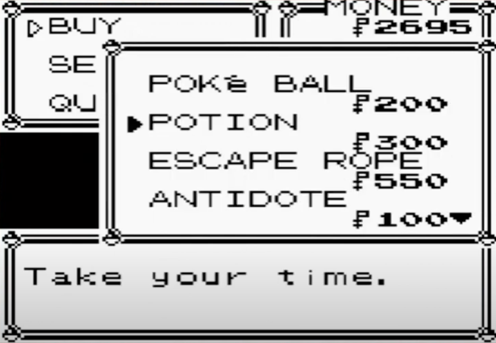
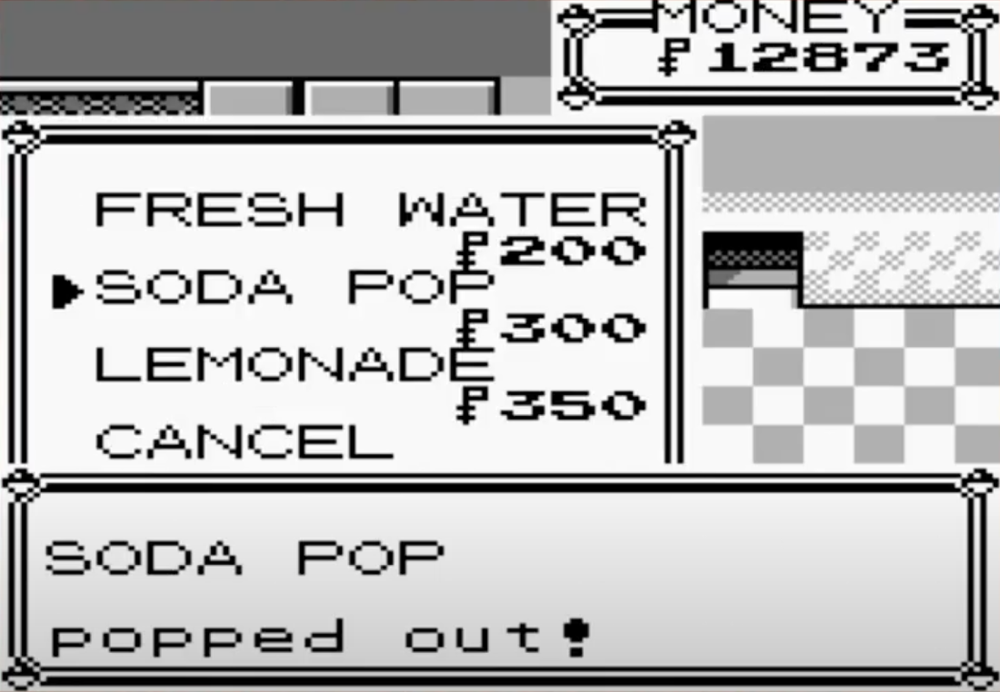
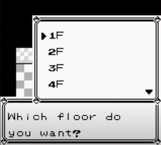

# list menu

 &nbsp; 

list menuという [list](./list.md) の内容を表示しプレイヤーに選択させるための [menu](./menu.md)

スタートメニューのかばんやショップの売り物のリストなどを表示する menu のことである

## List Menu ID

list menuで表示されるlistのカテゴリはあらかじめ決まっており、それらを指定するのがList Menu ID

#### PCPOKEMONLISTMENU

PCのポケモン引き出し預け時のポケモン選択リスト

#### MOVESLISTMENU

技選択リスト

#### PRICEDITEMLISTMENU

ショップで買いたいもの(売り物一覧)

#### ITEMLISTMENU

スタートメニューのかばん / ショップで売りたいもの(中身はかばんと同じ)

#### SPECIALLISTMENU

エレベータの階層一覧 / バッジのリスト(ハナダのバッジおじさん) などの特別な選択リスト

## memo

メニューに一度に表示できるアイテムは4つまで

カーソルが3項目めから4項目めにいくときにスクロールが生じる(よってカーソルは4項目目にいくことはない)

画面の定位置に表示される