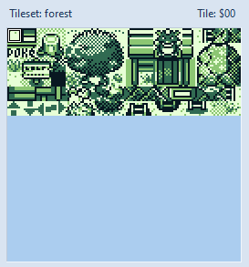
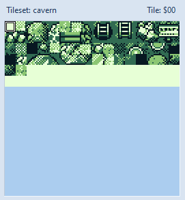

# タイル

タイルは8*8pxのグラフィックデータでこれよりサイズの小さいグラフィックデータは存在しない

ゲームボーイのハードウェアの仕様もあって8*8pxのタイルがポケモン赤のグラフィックを構成する最小単位である

## タイルID

このレポジトリでは、`タイルID`, `tileID`, `TileID`という表記で表されるタイルのID

タイルセット(後述)のタイルを識別するのに利用される。

## タイルセットについて

タイルセット(タイルの集合)という名前通り、一定のルールにしたがってタイルをまとめたデータのこと

ポケモン赤では、タイルはマップのカテゴリごと(町、森、洞窟など)にまとめられてタイルセットになっている

森のタイルセット  
  

洞窟のタイルセット  
 

### tileset header

グラフィックデータへの参照情報などタイルセットの構築に必要な情報をまとめたものを tileset header とこのレポジトリでは呼ぶ

tileset header は `./data/tileset_headers.asm` でtilesetマクロによって定義されている

```asm 
; - \1 (2byte) = Block bstデータへのポインタ
; - \2 (2byte) = GFX 2bppデータへのポインタ
; - \3 (2byte) = Coll tilecollデータへのポインタ
; - \4, \5, \6 (1+1+1 byte) = counter tiles
; - \7 (1byte) = grass tile
; - \8 (1byte) = permission (indoor, cave, outdoor)
tileset Overworld_Block,   Overworld_GFX,   Overworld_Coll,   $FF,$FF,$FF, $52, OUTDOOR
```

### tilesetのデータフォーマット

タイルセットを構築するデータには

- bst
- 2bpp
- tilecoll

の3つのデータがある

#### bst

タイルをまとめたブロックセットを定義しているデータ

詳細は [blk](./blk.md)参照

#### 2bpp

`gfx/tilesets`で定義されるタイルセットのグラフィックデータ

詳細は [2bpp](./../2bpp.md)参照

#### tilecoll

tile collisionの略

タイルの障害物属性を定義したもの

C言語で表すと次のようなフォーマットになる

```c
typedef struct tileColl
{
    UBYTE tileID;
    UBYTE collisionType;
} TileCollision;
```

### tileset ID

タイルセットを識別するためのIDは`constants/tilesets.asm`で定義されている

## 参考

[Gameboy Development Forum](https://gbdev.gg8.se/forums/viewtopic.php?id=199)