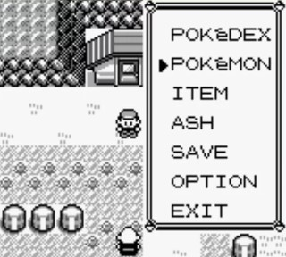
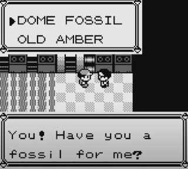

# メニュー

ポケモン赤でのメニューは、

- マップ上でスタートボタンを押すと現れるウィンドウ
- はい、いいえの2択ウィンドウ
- その他の様々な選択肢を表示するウィンドウ

といったようにプレイヤーに選択を要求するウィンドウのことを表している

## 例  

 &nbsp; 

## wrapping

選択メニューで一番下の選択肢にあるときに下を押したときに一番上に戻る、または一番上のメニューにあるときに上を押したときに一番下にいく状態のこと

## list menu

list menuというカテゴリに属するメニューもある

スタートメニューのかばんやショップの売り物のリストなどを表示するメニューのことである

list menuで表示されるlistの一覧は`constants/list_constants.asm`参照

TODO: ウィンドウの描画開始位置が固定されていたりなどlist menuにはいくつか特徴があるがなぜわざわざ特別視しているのかは不明

#### list menuの例

 &nbsp; 
