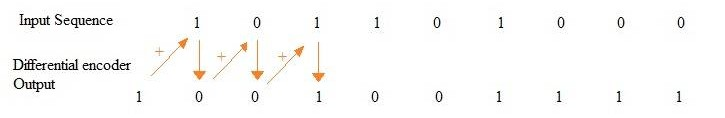
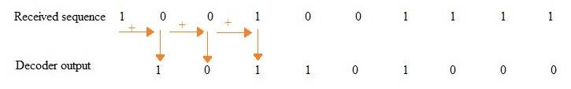

# Differential encoding

Differential encoding ではあるデータを連続したデジタルデータの隣符号との差分を使って表すデータ方式である

## Encode

元のバイナリ列をbin、エンコード後のバイナリ列をebinとすると



```
ebin[n] = bin[n] + ebin[n-1]
```

## Decode

元のバイナリ列をbin、デコード前のエンコードされたバイナリ列をebinとすると



```
bin[n] = ebin[n] + ebin[n-1]
```

つまりebin[n-1]が 0なら ebin[n]がそのままbin[n]になり 1ならebin[n]をトグルしたものがbin[n]になる

## 参考

- [Differential encoder vs differential decoder](https://www.rfwireless-world.com/Terminology/differential-encoder-vs-differential-decoder.html)