# Uncompress

解凍(Uncompress)を行うコードは `home/pic.asm` に格納されている

## workflow

Uncompress処理は `UncompressSpriteData` から始まり以下のように続いていく

<dl>
  <dt>UncompressSpriteData</dt>
  <dd>aレジスタで指定した対象のグラフィックがあるバンクにスイッチして _UncompressSpriteData を呼び出す</dd>

  <dt>_UncompressSpriteData</dt>
  <dd>スプライトをロードするのに必要なデータを初期化し、 UncompressSpriteDataLoop を呼び出す</dd>

  <dt>UncompressSpriteDataLoop</dt>
  <dd>Uncompress処理は実質的にここから始まる。</dd>
  <dd>詳しくは後述。</dd>

  <dt>.WriteSpriteBitsToBuffer & MoveToNextBufferPosition</dt>
  <dd>入力から読み取ったデータを Unpack処理で使うoutput bufferに格納する。</dd>
  <dd>詳しくは後述。</dd>

  <dt>.readRLEncodedZeros</dt>
  <dd>ランレングス圧縮されたデータを解凍する。</dd>
  <dd>詳しくは後述。</dd>

  <dt>UnpackSprite</dt>
  <dd>output bufferに入っているデータを Unpackして output bufferに戻す。</dd>
  <dd>詳しくは後述。</dd>
</dl>

## UncompressSpriteDataLoop

### 変数

UncompressSpriteDataLoop で使用される変数について

<dl>
  <dt>wSpriteInputPtr</dt>
  <dd>ここから解凍対象の圧縮されたスプライトのグラフィックデータを読み込む</dd>

  <dt>wSpriteOutputPtr</dt>
  <dd>ここに解凍したスプライトのグラフィックデータを書き込む</dd>

  <dt>wSpriteLoadFlags</dt>
  <dd>解凍処理の制御フラグ</dd>
</dl>

### workflow

基本的な処理は、入力から2bit読み取ってoutput bufferに書き込んでいくというもの

output buffer は `UncompressSpriteDataLoop`の最初に `wSpriteLoadFlags`のbit0によって sSpriteBuffer1 と sSpriteBuffer2のどちらを使うか決まる 

.readNextInput では対象のスプライトデータを 2bitずつ output bufferにコピーしていくループに入る

対象のスプライトデータの全てをoutput bufferにコピーし終えたときは `UnpackSprite`を呼び出す

データによってはランレングス圧縮されていることもあり、その場合は入力のbitからわかるのでそのときには .readRLEncodedZeros でランレングス圧縮されたスプライトデータを解凍して output buffer にコピーする 

ランレングス圧縮されたデータをコピーし終えた後は .readNextInput のループに戻る

### .readRLEncodedZeros

スプライトデータによってはランレングス圧縮されているものもある

## UnpackSprite

スプライトデータを全て outpub bufferにコピーし終えた後は、この関数で Unpack処理を行っていく

