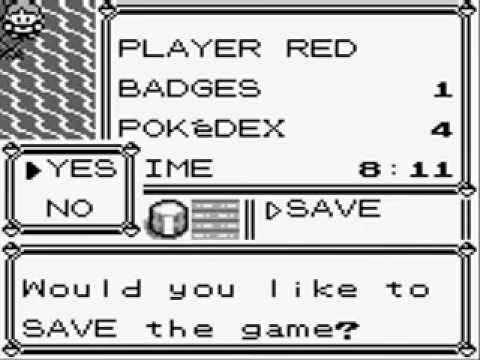

**Note:** _This section hasn’t been translated into English yet. The original Japanese version is below…_

# セーブ

セーブは、ゲームボーイ本体が終了しても動作し続けるカートリッジ上のメモリ領域である `SRAM (0xa000-0xbfff)` にゲーム進行状況をコピーすることで行われる

セーブに関する処理は `engine/save.asm` にまとめられている

## Load

セーブデータを読み込む処理は `LoadSAV` で行われる

`LoadSAV` は タイトル画面でボタンを押して メインメニュー(CONTINUE, NEW GAME, ...)に入ったときに実行される 

読み込み処理は

1. セーブデータのチェックサムを検証
2. チェックサムが正しいならデータを SRAMのバンク1 から WRAMにコピー
3. チェックサムが一致しないなら セーブデータは破損していますというメッセージを表示

という手順で行われる

## Save

データのセーブは `SaveSAV` で行われる

セーブ処理は

1. セーブを行うかユーザーに確認
2. 確認が取れたなら、WRAM から SRAMのバンク1　にゲーム進行状況に関するデータをコピー
3. チェックサムを計算して SRAM に格納
4. セーブ終了の旨をユーザーに伝える

WRAM から SRAM に写すデータは ゲーム進行に関わるWRAM領域 を加工せずまるまるコピーしたものである

おそらく加工処理が入ると セーブ時間が延びることや SRAMの要領を考えてそのままコピーしても問題がなさそうなのでそのままコピーを選択したと思われる
