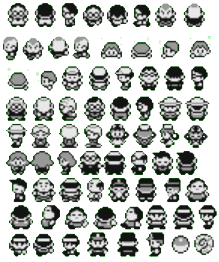

# sprite

## ポケモン赤でのスプライト

ポケモン赤でのスプライトは、プレイヤーやNPC、特定の物体などが該当する

スプライトの一例  

## OAM  

[OAM](./oam.md)参照

## 最大人数

OAM は 8\*8pxサイズのタイルであるのに対して、ポケモン赤でのスプライトは 16\*16pxとスプライト一つにつき 4つの OAMを使う

OAM は 40スロットなので ポケモン赤で画面上に存在できるスプライトの最大数は 10個である  

## スプライトの保持しているデータ

[スプライトデータ](./sprite_data.md)参照

## スプライトの更新

[スプライトの更新](./update.md)参照

## スプライトのオフセット

このレポジトリではスプライトのオフセットというのは、マップ上のスプライトのインデックス番号のことであり、**$c1Xn, $c2XnのXの値**のことを指す。

## Sprite ID

スプライトのタイルデータの取得や `Map Object`の objectsマクロ などでスプライトを識別するためのID 

`constants/sprite_constants.asm` で定義されている。

## Emotion Bubble

!マークなどの感情を表す吹き出しのこと

`engine/overworld/emotion_bubbles.asm`で詳細に定義されている

## VRAM 上のタイルデータ

マップにいるときスプライトの2bppタイルデータについては [こちら](vram.md) を参照