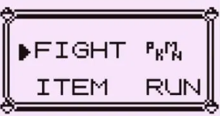

# 文字コード

ゲーム内で使われる文字コード

[charmap.asm](../charmap.asm)で定義されており、すべて1バイトのバイト長で表される。

## charmapマクロ

charmapは文字コードを定義するマクロで、例えば

```asm
charmap "a", $A0
```

と定義したときは、アセンブリ中での文字"a"はバイトデータ0xA0に置換される

## 特殊文字

ポケモン赤のゲーム内ではいくつか特殊な文字が使われている。

例えば英語版のROMではポケモンという単語は次のように特殊な文字で表される。



これはUnicodeにはない文字コードのため逆アセンブルされたコード内では\<pkmn\>と表記している

ほかにも
- \<PLAYER\>  ->  プレイヤーの名前
- \<RIVAL\>  ->  ライバルの名前
- \# -> POKé おそらくPOKéが頻出するため容量を節約するために1バイトで表せるようにした？

などがcharmap.asmでは定義されている。

どうやらプレイヤーやライバルの名前などのデータはゲーム内では文字データ扱いとしておき、文字の描画時にその文字コードがあったときは特別な処理を行うようにしている。

## @について

文字コード0x50 "@"はポケモン赤において一種の終端記号として扱われており、@にあたった時点で文字列の描画や、テキストコマンドの実行を終える。
