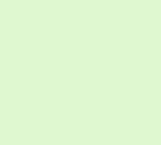
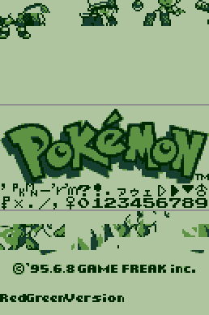
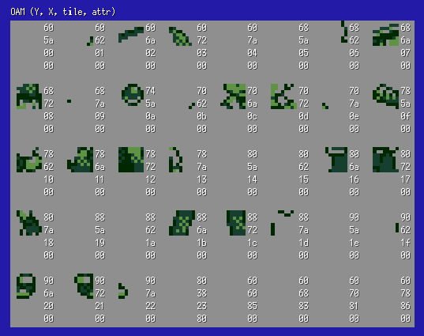
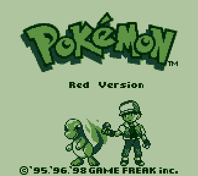

**Note:** _This section hasn’t been translated into English yet. The original Japanese version is below…_

# タイトル画面

## タイルデータ

## OAM

主人公のグラフィックはスプライトとして配置されている

## 描画の流れ

タイトル画面の描画では以下の構成要素をそれぞれ描画していく

描画を行うコードは `engine/tilescreen.asm` の `DisplayTitleScreen` で定義されている

- ロゴ
- バージョン情報(Red Version)
- ポケモン
- 主人公
- コピーライト

### 1. タイルデータの準備

VRAMのタイルデータにコピーライト、ロゴなどタイトル画面に必要なタイルデータをコピーする

### 2. ベースとなるレイヤーの構築

ポケモンのロゴ、主人公、コピーライトを wTileMapに配置して SaveScreenTilesToBuffer2 で レイヤー情報を保存しておく

主人公のグラフィックデータはスプライトであることに注意 (上のOAM参照)

### 3. ポケモンのグラフィックありのレイヤーを構築

2で作ったレイヤーにポケモンのグラフィックを配置する

配置されるのは、赤版ならヒトカゲ、青版ならゼニガメ

レイヤーに配置を終えたら SaveScreenTilesToBuffer1 でレイヤー情報を保存しておく(2とは違うバッファに保存する)

### 4. タイトル画面のinit処理

ここでは、ポケモンのロゴが降りてくる処理とバージョン情報が右からスクロールしてくる処理を行う

### 5. タイトル画面の描画

init処理を終えたら以下のタイトル画面が描画されている状態になる

### 6. ユーザーのキー入力があるまでポケモンを横スクロールで切り替える

一定時間キー入力がなかった場合にはポケモンが切り替わる処理が起こる

最初の切り替えのときだけ主人公の持っているモンスターボールが上に跳ねる処理がある

### 7. キー入力の内容に応じて次のモードへ

Start や Aボタンが押されたときはメインメニューのモードへ、`↑ + Select + B` が押されたときは、セーブデータを削除するモードへ切り替わる

このようにしてタイトル画面モードが終了し次のモードへと進んでいく
