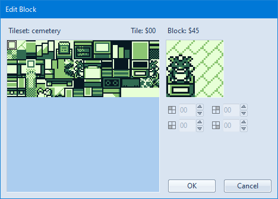

# maps

マップデータが入っている

## blkファイルについて

blkファイルはブロックIDからなるデータリストです。パレットなどの色データは含まれていません。

ポケモン赤では、マップはタイル単位ではなく4*4のタイルの塊であるブロック単位で構成されています。  
ブロックIDはブロックデータの塊であるブロックセットから特定のブロックを指定するためのIDです。

## ブロックについて

各ブロックは縦4枚、横4枚のタイルからなっています。

ブロックセットのデータはmap/ではなくgfx/blocksetsに含まれています。

## タイルについて

タイルは8*8pxのグラフィックデータでこれよりサイズの小さいグラフィックデータは存在しません。

ゲームボーイのハードウェアの仕様もあって8*8pxのタイルがポケモン赤のグラフィックを構成する最小単位です。

タイルセット(タイルデータの塊)のデータはgfx/tilesetsに含まれています。

## マップデータの編集

マップデータの編集は[Polished Map](https://hax.iimarckus.org/topic/7222/)というソフトウェアを使うと楽に行えます。

## 参考

[.blk Readability](https://github.com/pret/pokered/issues/158)
[discord](https://discordapp.com/channels/442462691542695948/442462691542695957/626440045863370795)
[Polished Map 4.5.0 and 2.5.0++: a pokecrystal and pokered map editor](https://hax.iimarckus.org/topic/7222/)
